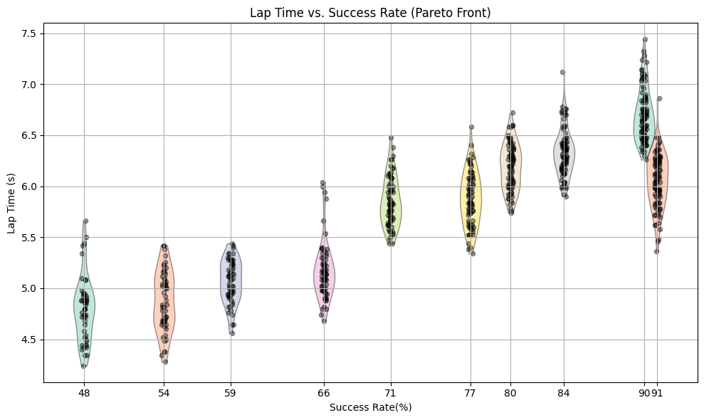

# Autonomous Drone Racing Project Course
## MPCC with trajectory translation
### Level2 (stable): success rate 91% average 6.05s
    python ./scripts/sim.py --config level2.toml --controller mpcc_traj_translation_simplified.py --n_runs 10 -g
### Level2 (leader board): success rate 48% average 4.70s
    python ./scripts/sim.py --config level2.toml --controller mpcc_traj_translation_real_fast.py --n_runs 10 -g
## Vanilla MPCC
### Level0: average 3.46s
    python ./scripts/sim.py --config level0.toml --controller mpcc.py --n_runs 10 -g
## Experiments Results
### Violin plots of some sets of parameters from Bayesian Optimization
successful rollouts from 100 runs

