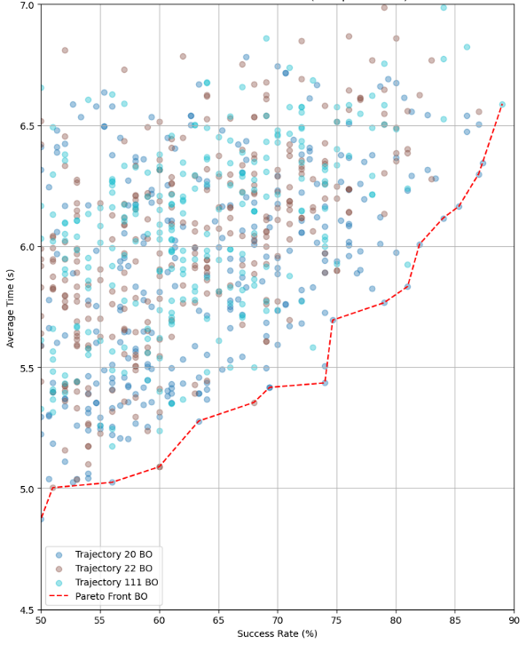
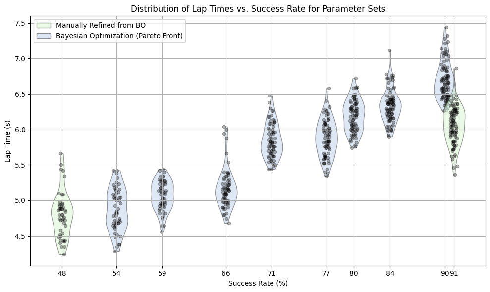
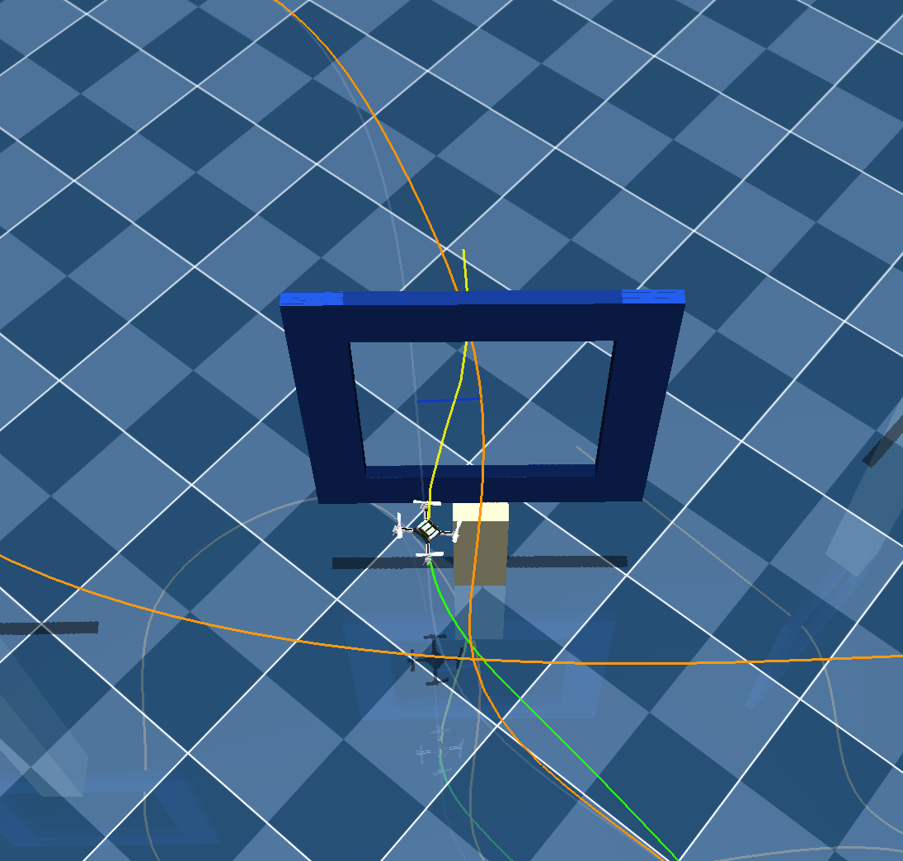
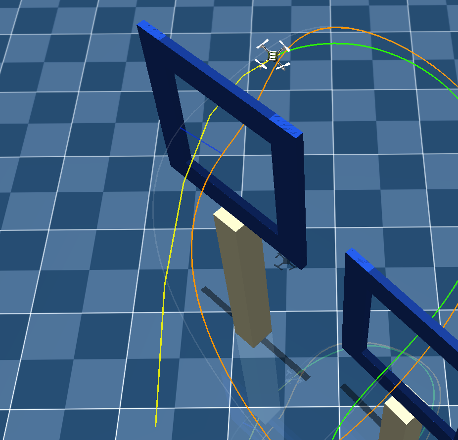
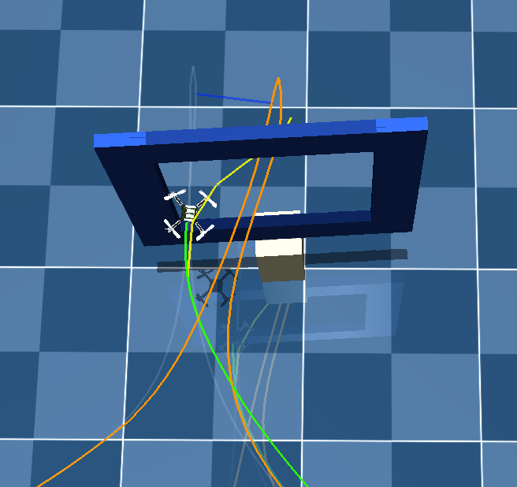
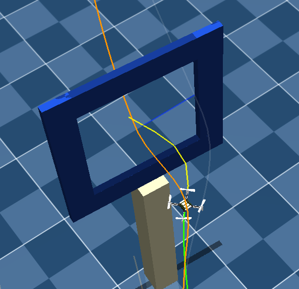

# Autonomous Drone Racing Project Course
install dependancy & acados

activate virtual env at first

    mamba activate race

## Vanilla MPCC
### Level0: average 3.46s
    python ./scripts/sim.py --config level0.toml --controller mpcc.py --n_runs 10 -g

## MPCC with trajectory translation (Final)
### Level2 (stable): success rate 91% average 6.05s
    python ./scripts/sim.py --config level2.toml --controller mpcc_traj_translation_simplified.py --n_runs 10 -g
### Level2 (leader board): success rate 48% average 4.70s
    python ./scripts/sim.py --config level2.toml --controller mpcc_traj_translation_real_fast.py --n_runs 10 -g

## Experiments Results
### Pareto front of trials in Bayesian Optimiation (100 runs/trial)

### Violin plots of some sets of parameters from Bayesian Optimization
successful rollouts from 100 runs

### Video Demostrations (under ./results)
Video of realworld deployment using the fast parameter set. Lap time 5.75 sec.

- 🎬 results/real_5_75sec.mp4

Simulation Demos using stable parameter set. Average lap time 6.05 sec.

- 🎬 results/sim_demos.mp4

## Method Illustrations
### Gate Translation Visualization
Stick to one planned trajectory, shift the whole trajectory toward the gate offset, then smooth the translation using Gaussian weights.

### Obstacle Cost Design
Red area: Gaussian shaped obstacle cost

Grey area: Suppress q_c, μ when approaching obstacles: force the drone to slow down, allow deviation from original trajectory

### Gate Translation Demo Snapshots
Examples of trajectory translation under different gate configurations.

